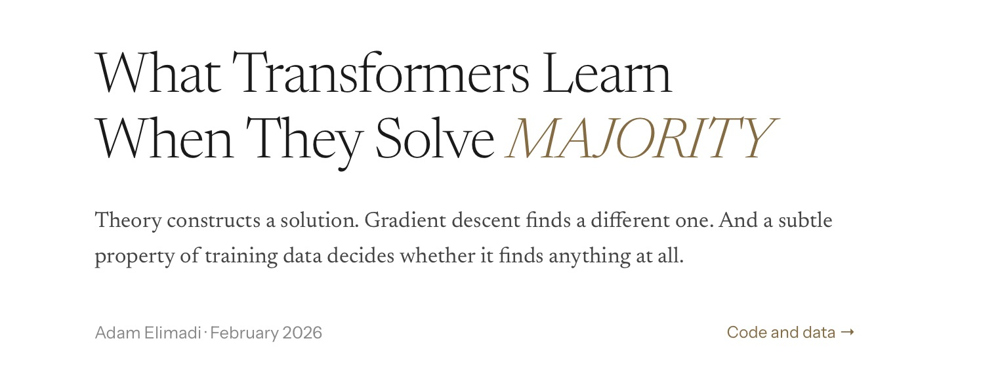

# Transformers-as-Circuits

[](https://brokttv.github.io/Blog-1/)

---
## Setup
```bash
pip install -r requirements.txt
```

## Requirements
```
torch
numpy
tqdm
```
---
## Usage

### Basic run (Majority with AdamW)
```bash
python main.py
```


### Example 1: Majority with Soft Transformer


```bash
python main.py --task majority --epochs 50 --batch-size 128 --train-num-samples 16384 --train-seq-len 63 --test-num-samples 4096 --test-seq-len 63 --optim AdamW --lr 0.005 --data_seed 123 --device cuda
```

### Example 2: Majority with Saturatd Transformer
```bash
python main.py --task majority --epochs 80 --batch-size 256 --train-num-samples 8192 --train-seq-len 31 --test-num-samples 2048 --test-seq-len 31 --train-saturated --optim SGD --lr 0.1 --data-seed 7
```
### Example 3: OR-Task
```bash
python main.py --task or --epochs 30 --batch-size 64 --train-num-samples 8192 --train-seq-len 127 --test-num-samples 2048 --test-seq-len 127 --optim AdamW --lr 0.003 --data_seed 999 --device mps
```
---


## 📑 Citation

If you find this work useful, please cite it as:

```bibtex
@misc{Elimadi2026majority,
  title        = {Transformers-on-Majority: Mapping Theory to Reality Revealing new Mechanistic Features in Transformers Learnability},
  author       = {Adam Elimadi},
  year         = {2026},
  howpublished = {\url{https://github.com/Brokttv/Transformers-on-Majority}},
}


